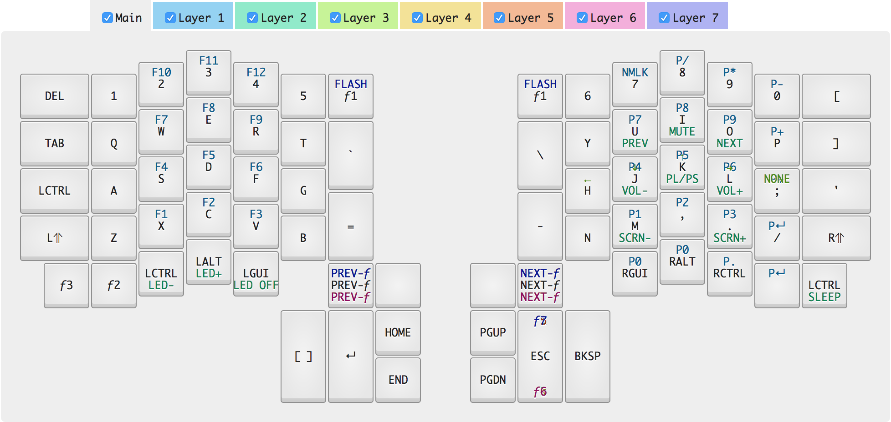

# Infinity ErgoDox Layout

## Install

1. Copy the contents of `keymap.json` into the [Infinity ErgoDox Configurator](https://input.club/configurator-ergodox/)
2. Download firmware
3. Unzip contents of the `.zip` into this directory
4. Plug in left ErgoDox
5. Run `make install-left`
6. Unplug left ErgoDox
7. Plug in right ErgoDox
8. Run `make install-right`
